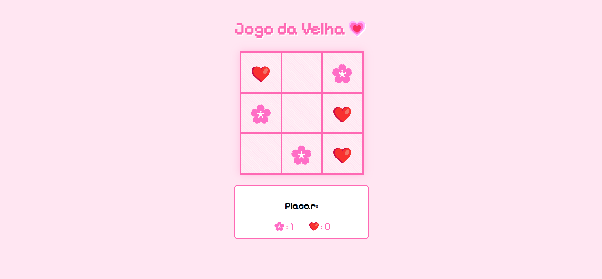

#  Jogo da Velha 

 Jogo da velha, desenvolvido com HTML, CSS e JavaScript.

 

## ✨ Funcionalidades Atuais
- **Modos de Jogo:**
  - 🤼 Modo multiplayer local (2 jogadores)
  - 🤖 Modo vs IA básica (movimentos aleatórios)
- **Design Personalizado:**
  - 🌸 Temática fofa com emojis (flores vs corações)
  - 🎨 Paleta de cores suaves e gradientes
  - 🕹️ Efeitos visuais interativos
- **Recursos:**
  - 📊 Placar dinâmico
  - 🎉 Exibição de mensagem de vitória/empate estilizada
  - 🔄 Reinicialização automática após o término da partida
 - 📱 Design responsivo
 - 
## 🚧 Melhorias Planejadas (Versão 1.1+)
- **Novos Recursos:**
  - 🔊 Efeitos sonoros
- **Aprimoramentos:**
  - 🧠 IA inteligente
  - 🔧 Menu de personalização (cores/temas)
  - 🛠️ Refatoração de código para melhor performance

## 🛠️ Tecnologias Utilizadas
- **Frontend:**
  - HTML5
  - CSS3 
  - JavaScript vanilla

